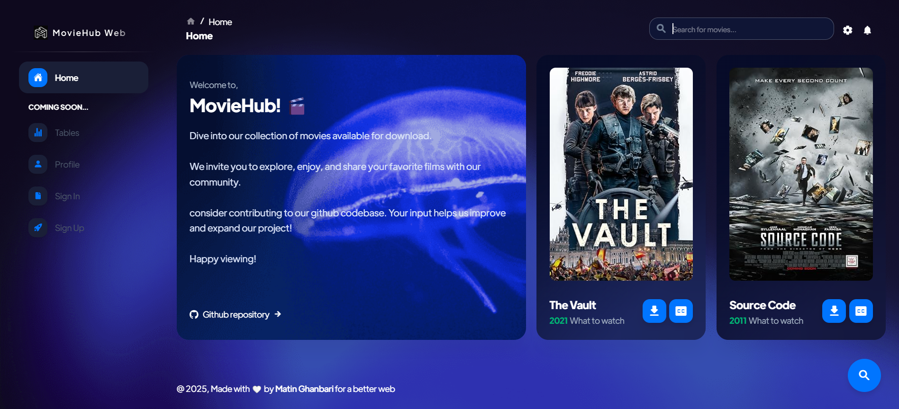

# 🎬 MovieHub
Movies for free of all genres!

## ✨ Features
- Easy search and download movies

# 📸 Screenshots
Page | Image
--- | ---
Home Page | 
Seach | 


## 🎥 Usage 
- Browse through the movie library by genre or search for specific titles.
- Click on a movie to view details, including a synopsis, cast, and ratings.
- Add movies to your watchlist for easy access later.

## 🤝 Contributing 
We welcome contributions from the community! If you'd like to help improve MovieHub, please follow these steps:
1. **Fork the repository**: Click the "Fork" button at the top right of the page to create your own copy of the project.
2. **Create a new branch**: Use a descriptive name for your branch, such as `feature/add-search-bar` or `bugfix/fix-typo`.
   ```bash 
   git checkout -b your-branch-name
   ```
3. **Make your changes**: Implement your feature or fix the bug.
4. **Commit your changes**: Write a clear commit message describing your changes.
   ```bash
   git commit -m "Add a brief description of your changes"
   ```
5. **Push to your branch**: 
   ```bash
   git push origin your-branch-name
   ```
6. **Open a pull request**: Go to the original repository and click on "New Pull Request." Provide a description of your changes and submit it for review.

Thank you for your contributions!
