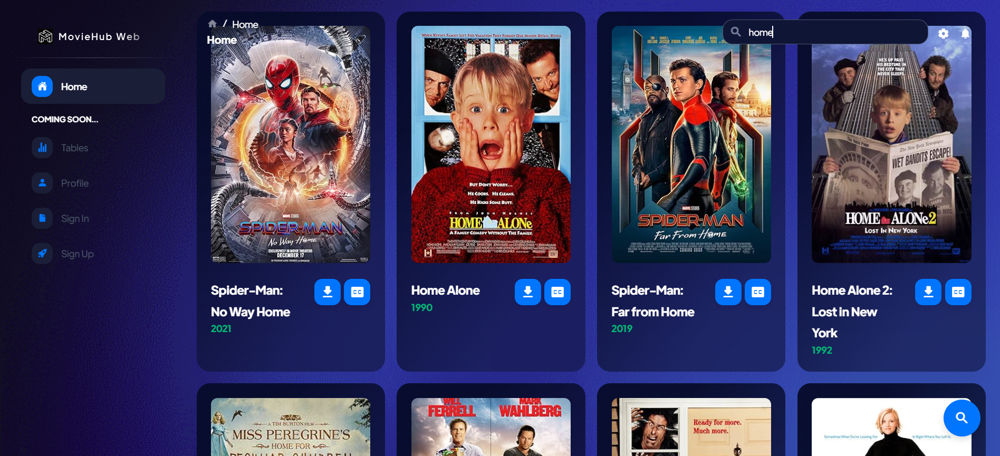

<h1 align="center">MovieHub</h1>
<p align="center">
  
</p>

## Overview
This project is a movie recommendation and search application that allows users to discover new films based on their interests. Users can view two recommended movies, search for movies by title, and access detailed information about each film, including posters, release years, and download options. Additionally, users can download movies in various qualities and obtain Farsi subtitles for each movie displayed in the search results.


## Features
- Recommended Movies: Users can view two movie recommendations tailored to their preferences.
- Movie Search: Search for movies by title to find specific films.
- Related Movies: The application displays the best related movies based on the search query.
- Movie Details: Users can view essential information about each movie, including:
   - Movie Poster
   - Movie Title
   - Release Year
- Download Options: Users can download movies in multiple qualities to suit their needs.
- Farsi Subtitles: Download Farsi subtitles for each movie shown in the search results.

## Screenshots
Page | Image
--- | ---
Home Page | 
Seach | 


## Contributing 
We welcome contributions from the community! If you'd like to help improve MovieHub, please follow these steps:
1. **Fork the repository**: Click the "Fork" button at the top right of the page to create your own copy of the project.
2. **Create a new branch**: Use a descriptive name for your branch, such as `feature/add-search-bar` or `bugfix/fix-typo`.
   ```bash 
   git checkout -b feature/YourFeature
   ```
3. **Make your changes**: Implement your feature or fix the bug.
4. **Commit your changes**: Write a clear commit message describing your changes.
   ```bash
   git commit -m "Add a brief description of your changes"
   ```
5. **Push to your branch**: 
   ```bash
   git push origin feature/YourFeature
   ```
6. **Open a pull request**: Go to the original repository and click on "New Pull Request." Provide a description of your changes and submit it for review.

Thank you for your contributions!

## License
This project is licensed under the [MIT](LICENSE) License - see the LICENSE file for details.


